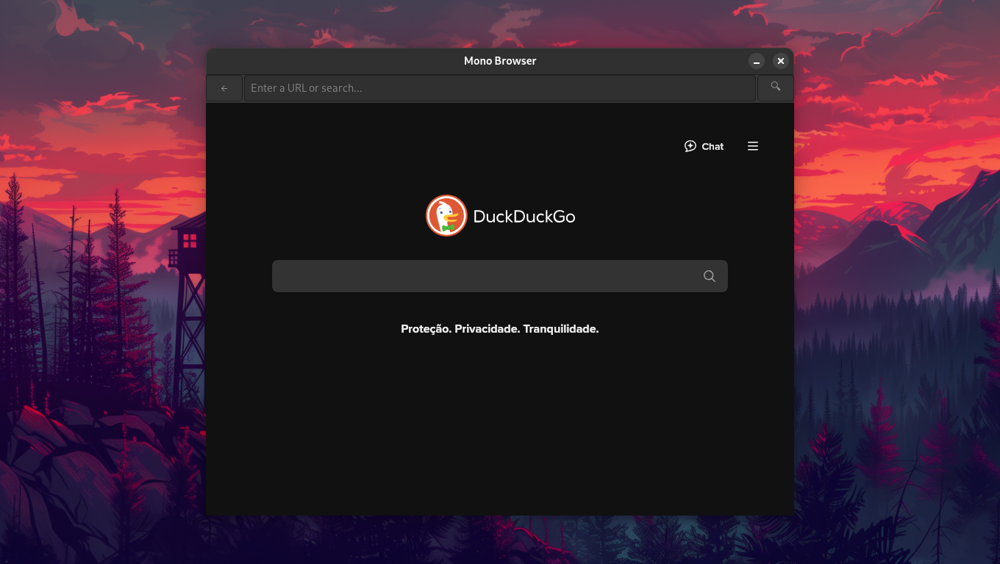

# Mono-Browser

# ARCHIVED REPO

A very simple browser using WebKit with WebView and GTK programmed in c

# Compile

You need a C/C++ compiler, in this case we are using GCC (GNU Compiler Collection), GTK and WebKit2GTK.

Use this shell code on terminal (Linux):

```shell
cd Mono-Browser/src
gcc browser.c -o MonoBrowser `pkg-config --cflags --libs webkit2gtk-4.0 gtk+-3.0`
./MonoBrowser
```


